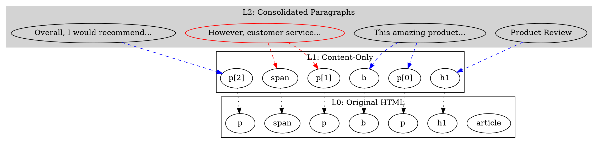

# **Technical Briefing: Multi-Layer Graph Abstraction & Clustering Framework for HTML Content Transformation**

**Version:** v0.8.4
**Last Updated:** November 20, 2025

## **1. Purpose of This Brief**

This document describes a strategy for transforming HTML into a hierarchy of graph abstractions that enable clustering, sentiment classification, and structured content rewriting.
It is intended for an LLM or developer working with the mitmproxy-based HTML transformation pipeline and mGraphDB.

The goal is to:

* Convert HTML into a graph-based representation
* Build multiple layers of abstraction on top of that graph
* Maintain reversible links back to the original HTML structure
* Enable automated clustering independent of HTML semantics
* Support higher-level pattern recognition (paragraphs, lists, cards, etc.)
* Use the resulting multi-level graph to drive classification and content rewriting

This document is self-contained.

---

# **2. Original HTML Graph: The Level-0 (2D) DOM Tree**

HTML already represents a tree structure:

```
HTML
 └─ BODY
     ├─ P
     │   └─ "Some text"
     ├─ DIV
     │   ├─ B
     │   │   └─ "bold text"
     │   └─ A
     │       └─ "link text"
```

In this model:

* Each **element** is a node
* Parent/child relationships are edges
* **Leaves are text nodes**
* Semantic operations currently operate directly on these text nodes

We call this **Level-0 (L0)** — the raw HTML tree.
This is what the HTML Service currently emits as `html_dict` in your pipeline.

---

# **3. Level-1 Graph: The Content-Only Subgraph (First Abstraction Pass)**

### **Goal**

Reduce graph size and focus only on nodes relevant for semantic classification.

### **Process**

Starting from *every text node* in L0:

1. Walk *upward* through parent nodes until reaching the root.
2. Build a new graph containing only the minimal necessary chain of ancestors.
3. **Discard branches that lead to no text nodes.**

This yields a **content-only graph** that contains:

* All text nodes
* All parents that structurally hold those text nodes
* No irrelevant wrappers, empty divs, etc.

### **Critical Design Requirement**

Every node in Level-1 must contain a reference to its origin:

```
L1Node.original_id = L0Node.unique_id   (from mGraphDB)
```

This ensures:

* Full reversibility
* The ability to apply transformations back onto the original page
* No loss of detail during abstraction

### **Benefits**

* Smaller graph
* Simplified navigation
* Clearer visualization
* Perfect mapping back to original nodes
* Completely automatic (no semantics required)

---

## **3.5 Graph Compression Rules**

Once L1 is built, we can apply compression rules to further simplify the graph structure:

### **1. Redundant Parent Collapsing**

If a parent node has only one child that is also not a text node, collapse them into a single reference chain.

**Example:**
```
DIV → SPAN → Text
```
Can be compressed to:
```
DIV → Text (with metadata preserving SPAN's original_id)
```

### **2. Empty Branch Pruning**

Already handled by the content-only extraction process, but worth noting explicitly: any branch that contains no text nodes is completely removed from L1.

### **3. Structural Wrapper Removal**

Elements that add no semantic value (pure layout divs, wrapper spans, etc.) can be compressed while preserving the original_id reference chain.

**Example:**
```html
<div class="wrapper">
  <div class="container">
    <div class="inner">
      <p>Text content</p>
    </div>
  </div>
</div>
```

Can be compressed to:
```
wrapper_div → p → Text
```

With metadata storing the full path: `[wrapper_div_id, container_div_id, inner_div_id, p_id]`

### **Critical Principle**

All compression operations **must maintain the original_id reference chain**. This allows:
* Full reconstruction of the original HTML structure
* Accurate application of transformations to the correct elements
* Debugging and visualization of the compression decisions

---

# **4. Level-2 Graph: Automated Parent-Based Consolidation**

### **Problem**

Even the content-only graph may have too many small nodes.
Example: P → B → Text, or P → A → Span → Text.

### **Solution**

Automated consolidation by parent.

For every parent node in L1:

* Combine *all text content within its subtree* into a **single aggregated text node**.
* Create a new L2 node representing this combined semantic unit.

### **Example**

HTML:

```html
<p>
   This is <b>very</b> important <a>text</a>.
</p>
```

L2 node for this paragraph would contain:

```
"This is very important text."
```

### **Graph Construction**

* L2 nodes link back to original:

  ```
  L2Node.original_id = L0Node.id_of_paragraph
  ```
* Edges represent hierarchy but do not require recognizing semantic types yet.

### **Key Point**

This step is **mechanical** — purely parent-based.
No HTML semantics or pattern recognition are needed yet.

---

# **5. Higher-Level Graphs (Level-3, Level-4, …): Multi-Layer Abstraction**

Once we have L2, we can build additional abstraction layers.

### **General Rule**

Each higher level is formed by aggregating the nodes below it.

### **Conceptual Examples**

#### **L3: Section-level**

Combine all paragraphs under a `<section>` or `<div>` that has multiple child blocks.

#### **L4: Page-level**

A single node containing all text content of the entire page.

This creates a **vertical stack** of abstraction layers:

```
L4: Page-level content summary
  ↓
L3: Section summaries
  ↓
L2: Block/paragraph summaries
  ↓
L1: Individual text spans
  ↓
L0: Original HTML structure
```

Each level preserves references down the stack.

---

# **6. Essential Property: Full Bidirectional Traceability**

Every node in every abstraction layer must store:

```
- original_id       (ID in full HTML graph)
- parent_in_Ln
- children_in_Ln
- pointer_to_node_in_lower_level
```

This enables:

* Navigation **up** for clustering
* Navigation **down** to apply transforms
* Lossless reconstruction of the original structure
* Multi-resolution semantic analysis (text-level, paragraph-level, section-level)

### **Recommended Node Schema (mGraphDB Implementation)**

For concrete implementation using mGraphDB, we recommend the following schema:

```python
class Schema__HTML__Node__L1(Schema__MGraph__Node):
    node_data: Schema__HTML__Node__L1__Data

class Schema__HTML__Node__L1__Data(Type_Safe):
    original_html_id : Obj_Id                    # L0 reference
    layer_number     : int                       # 1, 2, 3, etc.
    node_path        : List[Obj_Id]             # Full path to root in current layer
    original_path    : List[Obj_Id]             # Full path in L0 (for compression tracking)
    aggregated_text  : Optional[str]            # For L2+ nodes
    pattern_type     : Optional[Safe_Id]        # For pattern nodes (Section 7)
    compression_info : Optional[Dict[str, Any]] # Metadata about compression applied

class Schema__HTML__Edge__Layer(Schema__MGraph__Edge):
    edge_data: Schema__HTML__Edge__Layer__Data

class Schema__HTML__Edge__Layer__Data(Type_Safe):
    relationship_type: Safe_Id  # 'parent', 'aggregates', 'references_original'
    layer_from       : int      # Source layer number
    layer_to         : int      # Target layer number
```

### **Navigation API Requirements**

The implementation should provide convenient navigation methods:

```python
# Navigate upward through layers
node_l2 = node_l1.get_parent_in_layer(2)
node_l3 = node_l1.get_ancestor_in_layer(3)

# Navigate downward
original_nodes = node_l2.get_original_nodes()  # Returns all L0 nodes
l1_children = node_l2.get_children_in_layer(1)

# Traverse within same layer
siblings = node_l2.get_siblings()
parent = node_l2.get_parent()

# Get full path
path = node_l2.get_path_to_root()  # Within current layer
original_path = node_l2.get_original_path()  # In L0
```

---

# **7. Pattern-Based Clustering (HTML Patterns as Node Types)**

Once the automated abstraction layers exist, we can add **semantic interpretation**.

Common HTML content patterns include:

* Paragraph block
* Heading + paragraph
* Bullet list (`<ul>/<ol>`)
* Card with image + text
* Article section
* Tweet-like block (avatar + text)
* Generic container with mixed content

At this stage you can introduce **pattern nodes**:

```
PatternNode.type = "paragraph-block"
PatternNode.type = "bullet-list"
PatternNode.type = "media-card"
...
```

These nodes:

* Sit at appropriate abstraction levels
* Allow predictable clustering
* Provide a visual reconstruction of page structure
* Enable consistent rewriting and moderation logic

---

# **8. Automatic Clustering Strategies Enabled by The Multi-Level Graph**

With multi-level graphs, clustering becomes trivial:

### **1. Parent-Based Clustering (already built-in)**

Nodes that share a parent in any Lx level form a natural cluster.

### **2. Content Volume Clustering**

Aggregate nodes with too-small text spans into larger units.

### **3. Structural Clustering**

Cluster nodes that share common structural ancestry (e.g., all `<li>` inside a `<ul>`).

### **4. Semantic Clustering**

Cluster nodes based on:

* sentiment similarity
* toxicity
* topic similarity
* threshold-based scoring
* contextual weighting

### **5. Pattern Clustering**

Group all nodes that represent:

* lists
* cards
* repeated layout patterns
* etc.

### **6. The Finite Patterns Principle**

**Key insight:** Despite the infinite variety of web content, **HTML structural patterns are finite and predictable**. 

This is a foundational principle that explains why the multi-layer approach works effectively at scale.

Common patterns that repeat across millions of websites include:

* **Paragraph blocks** (P, DIV with text)
* **List structures** (UL/OL with LI items)
* **Card layouts** (container with image + text)
* **Navigation menus** (nested lists with links)
* **Article sections** (heading + paragraphs)
* **Comment threads** (nested recursive structures)
* **Media blocks** (image/video + caption)
* **Table layouts** (structured data presentation)
* **Form structures** (labels + inputs + buttons)
* **Hero sections** (large image + heading + CTA)

#### **Why This Matters**

Because these patterns repeat predictably, we can:

1. **Build a pattern library over time** — Catalog common patterns and their variations
2. **Automatically recognize patterns in new content** — Match structural signatures
3. **Apply consistent clustering rules per pattern type** — Each pattern has optimal clustering behavior
4. **Achieve predictable transformation behavior** — Same patterns transform the same way
5. **Enable machine learning** — Train models on pattern recognition

#### **Pattern Recognition Strategy**

Patterns can be recognized at different layers:

* **L1**: Detect basic element groupings (e.g., "this is a list item")
* **L2**: Detect block-level patterns (e.g., "this is a paragraph block")
* **L3**: Detect section patterns (e.g., "this is a card grid")
* **L4**: Detect page-level patterns (e.g., "this is a blog post layout")

This finite pattern space makes the multi-layer approach **practical and scalable** for real-world web content.

---

# **9. How This Graph Supports Semantic Classification & Rewriting**

### **The pipeline becomes hierarchical:**

1. Run sentiment classification at **L2 or L3**

   * This makes classification more meaningful than word-level.

2. Use the classification result to decide cluster boundaries.
   Example: entire paragraph is negative → cluster the whole paragraph.

3. Apply transformations at the appropriate abstraction level.

   * Mask only the cluster nodes
   * Remove entire blocks
   * Blur content (text + images) at the cluster level
   * Replace whole-card with a placeholder

4. Use `original_id` references to rewrite L0 (the actual HTML page).

This enables **consistent, clean, predictable** transformations across the page.

---

# **10. Visualization Opportunities**

Because the structure becomes layered and pattern-based, you can:

* Render each abstraction level as a visual graph
* Present the page as a set of high-level blocks
* Visualize clusters directly
* Provide a "map" of the page structure
* Debug transformation decisions
* Simulate transformations before applying them

This is invaluable for debugging and introspection.

---

# **11. Summary of the Entire Architecture**

### **Inputs**

* Raw HTML
* DOM tree from HTML Service
* mGraphDB graph capabilities

### **Outputs**

* Multi-layer graph
* Pattern-based cluster graph
* Transformation-ready mapping
* Traceable rewrite instructions
* Visualization models

### **Guaranteed Properties**

* Lossless: always reversible
* Fully ID-linked: every node traces back to original HTML
* Multi-resolution: different abstraction levels for different tasks
* Extensible: pattern recognition can be layered in later
* Automated: first-pass clustering requires no HTML semantics

---

## **11.5 Integration with Existing Mitmproxy Pipeline**

This graph system fits into the existing mitmproxy transformation pipeline as an enhancement layer that provides structural intelligence.

### **Current 3-Step Pipeline**

The existing pipeline operates as follows:

1. **HTML → hash_mapping** (HTML Service)
2. **hash_mapping → classification + transformation** (Semantic Text Service)
3. **transformed_mapping → HTML** (HTML Service)

### **Enhanced Pipeline with Multi-Layer Graphs**

```
┌────────────────────────────────────────────────────────────────────┐
│                    Enhanced Transformation Pipeline                 │
└────────────────────────────────────────────────────────────────────┘

1. HTML Input
   │
   ├─→ [CURRENT] HTML Service: Generate hash_mapping
   │
   └─→ [NEW] Graph Builder: Construct L0 graph from HTML
       │
       ↓
2. Graph Abstraction Layers
   │
   ├─→ L0 → L1 (content-only extraction)
   ├─→ L1 → L2 (parent-based consolidation)
   ├─→ L2 → L3 (section-level aggregation)
   └─→ L3 → L4 (page-level aggregation)
       │
       ↓
3. Optimal Classification Level Selection
   │
   └─→ Choose L2 or L3 based on:
       • Content type (article vs. list vs. mixed)
       • Clustering requirements
       • Transformation mode from cookie
       │
       ↓
4. Semantic Classification
   │
   └─→ Semantic Text Service operates at selected layer
       • Input: Aggregated text from L2/L3 nodes
       • Output: Classification per cluster node
       │
       ↓
5. Cluster Decision Engine [NEW]
   │
   └─→ Make transformation decisions at cluster level:
       • Which clusters to transform
       • How to transform (mask, remove, blur)
       • Whether to include images/adjacent content
       │
       ↓
6. Transform Propagation [NEW]
   │
   └─→ Propagate transformations down layers:
       L2/L3 decisions → L1 nodes → L0 nodes
       │
       ↓
7. HTML Reconstruction
   │
   └─→ HTML Service: Apply L0 transforms to generate final HTML
       │
       ↓
8. Transformed HTML Output
```

### **Key Integration Points**

**Point A: Parallel Processing**
- The hash_mapping generation (current pipeline) can run in parallel with graph construction
- Both are needed: hash_mapping for Semantic Service, graph for clustering intelligence

**Point B: Classification Level**
- Instead of classifying individual text hashes, classify L2/L3 aggregated nodes
- This provides better semantic context (full paragraphs vs. individual sentences)

**Point C: Transform Decision**
- The Cluster Decision Engine uses graph structure to make intelligent grouping decisions
- Example: If 3 out of 5 sentences in a paragraph are negative, transform the entire paragraph

**Point D: Bidirectional Mapping**
- Transformations decided at L2/L3 are mapped back to specific text hashes in the hash_mapping
- This maintains compatibility with existing HTML Service reconstruction

### **Benefits of Integration**

1. **Better Classification Context**: Semantic analysis operates on meaningful units (paragraphs, sections) rather than individual text fragments

2. **Structural Awareness**: The system understands page structure, enabling better clustering decisions

3. **Predictable Transformations**: Pattern-based clustering ensures consistent behavior across similar content

4. **Backward Compatibility**: The hash_mapping interface remains unchanged; graph layer is additive

5. **Performance Optimization**: Classify fewer, larger units (L2 nodes) instead of many small units (text nodes)

---

# **12. What an Implementing LLM Should Focus On**

If you give this document and your source code to an LLM, it should:

1. Implement L0 → L1 extraction (content-only subgraph).
2. Build L2 by parent-based consolidation.
3. Generalize L(n) → L(n+1) aggregation.
4. Add mapping metadata to all nodes.
5. Ensure full upward and downward navigability.
6. Prepare a pattern-recognition module (later phase).
7. Integrate cluster-level rewriting into the HTML transformation pipeline.
8. Build debugging/visualization output of all abstraction levels.
9. Implement graph compression algorithms for L1 simplification.
10. Create a GraphNavigator utility for bidirectional traversal.
11. Build pattern recognition templates (start with 5-10 common patterns).
12. Create a ClusterDecisionEngine that operates at L2/L3 levels.
13. Implement transform propagation from high layers down to L0.
14. Add graph visualization exports at each layer level.
15. Integrate with existing mitmproxy pipeline components (HTML Service, Semantic Text Service, Cache Service).

---

# **13. Complete Example: Negative Sentiment Filtering**

This section demonstrates the entire transformation flow from HTML input through all graph layers to final transformed output.

### **Input HTML**

```html
<article>
  <h1>Product Review</h1>
  <p>This <b>amazing</b> product works well.</p>
  <p>However, the <span>customer service</span> was terrible and disappointing.</p>
  <p>Overall, I would recommend it with reservations.</p>
</article>
```

### **Step 1: Build L0 Graph (Original HTML Tree)**

```
article [node_1]
├─ h1 [node_2]
│  └─ text [node_3]: "Product Review"
├─ p [node_4]
│  ├─ text [node_5]: "This "
│  ├─ b [node_6]
│  │  └─ text [node_7]: "amazing"
│  └─ text [node_8]: " product works well."
├─ p [node_9]
│  ├─ text [node_10]: "However, the "
│  ├─ span [node_11]
│  │  └─ text [node_12]: "customer service"
│  └─ text [node_13]: " was terrible and disappointing."
└─ p [node_14]
   └─ text [node_15]: "Overall, I would recommend it with reservations."
```

**Node Count:** 15 nodes total

### **Step 2: Build L1 Graph (Content-Only Subgraph)**

Extract only paths from text nodes to root:

```
article [L1_1] (original_id: node_1)
├─ h1 [L1_2] (original_id: node_2)
│  └─ text [L1_3] (original_id: node_3): "Product Review"
├─ p [L1_4] (original_id: node_4)
│  ├─ b [L1_5] (original_id: node_6)
│  │  └─ text [L1_6] (original_id: node_7): "amazing"
│  ├─ text [L1_7] (original_id: node_5): "This "
│  └─ text [L1_8] (original_id: node_8): " product works well."
├─ p [L1_9] (original_id: node_9)
│  ├─ span [L1_10] (original_id: node_11)
│  │  └─ text [L1_11] (original_id: node_12): "customer service"
│  ├─ text [L1_12] (original_id: node_10): "However, the "
│  └─ text [L1_13] (original_id: node_13): " was terrible and disappointing."
└─ p [L1_14] (original_id: node_14)
   └─ text [L1_15] (original_id: node_15): "Overall, I would recommend it..."
```

**Node Count:** 15 nodes (same as L0, because no empty branches exist)

**Compression Applied:** None needed in this simple example, but in real pages, many wrapper divs would be eliminated.

### **Step 3: Build L2 Graph (Parent-Based Consolidation)**

Create aggregated nodes by combining all text within each parent:

```
article [L2_1] (original_id: node_1)
├─ L2_Node_Heading [L2_2] (original_id: node_2)
│  ├─ aggregated_text: "Product Review"
│  └─ references: [L1_3]
│
├─ L2_Node_Para1 [L2_3] (original_id: node_4)
│  ├─ aggregated_text: "This amazing product works well."
│  └─ references: [L1_6, L1_7, L1_8]
│
├─ L2_Node_Para2 [L2_4] (original_id: node_9)
│  ├─ aggregated_text: "However, the customer service was terrible and disappointing."
│  └─ references: [L1_11, L1_12, L1_13]
│
└─ L2_Node_Para3 [L2_5] (original_id: node_14)
   ├─ aggregated_text: "Overall, I would recommend it with reservations."
   └─ references: [L1_15]
```

**Node Count:** 5 nodes (dramatically reduced from 15)

**Key Observation:** Each L2 node represents a semantically meaningful unit (heading or paragraph).

### **Step 4: Build L3 Graph (Section-Level Aggregation)**

In this example, the article itself becomes a section:

```
L3_Article_Section [L3_1] (original_id: node_1)
├─ aggregated_text: "Product Review. This amazing product works well. 
│                   However, the customer service was terrible and 
│                   disappointing. Overall, I would recommend it with 
│                   reservations."
├─ references: [L2_2, L2_3, L2_4, L2_5]
└─ pattern_type: "article-with-heading"
```

**Node Count:** 1 node (entire article as a single unit)

### **Step 5: Sentiment Classification at L2 Level**

Run sentiment analysis on each L2 aggregated node:

```
L2_Node_Heading [L2_2]:
├─ Text: "Product Review"
├─ AWS Comprehend: { neutral: 0.92, positive: 0.04, negative: 0.03, mixed: 0.01 }
└─ Decision: KEEP (neutral)

L2_Node_Para1 [L2_3]:
├─ Text: "This amazing product works well."
├─ AWS Comprehend: { positive: 0.89, neutral: 0.08, negative: 0.02, mixed: 0.01 }
└─ Decision: KEEP (positive)

L2_Node_Para2 [L2_4]:
├─ Text: "However, the customer service was terrible and disappointing."
├─ AWS Comprehend: { negative: 0.91, neutral: 0.05, positive: 0.03, mixed: 0.01 }
├─ Filter: negative > 0.3 threshold
└─ Decision: TRANSFORM ← **FILTERED**

L2_Node_Para3 [L2_5]:
├─ Text: "Overall, I would recommend it with reservations."
├─ AWS Comprehend: { neutral: 0.56, positive: 0.31, negative: 0.11, mixed: 0.02 }
└─ Decision: KEEP (neutral/positive)
```

**Classification Summary:**
- Total L2 nodes: 4
- Nodes to keep: 3
- Nodes to transform: 1 (L2_4)

### **Step 6: Cluster Decision (Operating at L2 Level)**

```
ClusterDecisionEngine analysis:

Cluster_1 (L2_Node_Para2):
├─ Sentiment: negative (0.91)
├─ Exceeds threshold: YES (> 0.3)
├─ Cluster size: 1 paragraph
├─ Adjacent content: neutral/positive
├─ Decision: Transform this cluster only
└─ Transformation: XXX mode (character masking)
```

**No expansion needed:** The negative content is isolated to a single paragraph, so we don't need to cluster adjacent content.

### **Step 7: Transform Propagation (L2 → L1 → L0)**

Propagate the transformation decision down through layers:

```
L2_Node_Para2 [L2_4] marked for XXX transformation
  ↓
References: [L1_11, L1_12, L1_13]
  ↓
L1_11 (original_id: node_12): "customer service" → "xxxxxxxx xxxxxxx"
L1_12 (original_id: node_10): "However, the "    → "xxxxxxx, xxx "
L1_13 (original_id: node_13): " was terrible..." → " xxx xxxxxxxx xxx xxxxxxxxxxxx."
  ↓
Apply to L0 nodes:
├─ node_10 (text): "However, the " → "xxxxxxx, xxx "
├─ node_12 (text): "customer service" → "xxxxxxxx xxxxxxx"
└─ node_13 (text): " was terrible and disappointing." → " xxx xxxxxxxx xxx xxxxxxxxxxxx."
```

### **Step 8: Generate Transform Mapping for HTML Service**

Create the hash_mapping for the HTML Service (maintains backward compatibility):

```json
{
  "hash_mapping": {
    "h1_text_abc123": "Product Review",
    "p1_text_def456": "This ",
    "b1_text_ghi789": "amazing",
    "p1_text_jkl012": " product works well.",
    "p2_text_mno345": "xxxxxxx, xxx ",
    "span_text_pqr678": "xxxxxxxx xxxxxxx",
    "p2_text_stu901": " xxx xxxxxxxx xxx xxxxxxxxxxxx.",
    "p3_text_vwx234": "Overall, I would recommend it with reservations."
  }
}
```

### **Step 9: HTML Reconstruction**

HTML Service uses the transform mapping to rebuild the page:

```html
<article>
  <h1>Product Review</h1>
  <p>This <b>amazing</b> product works well.</p>
  <p>xxxxxxx, xxx <span>xxxxxxxx xxxxxxx</span> xxx xxxxxxxx xxx xxxxxxxxxxxx.</p>
  <p>Overall, I would recommend it with reservations.</p>
</article>
```

### **Step 10: Final Response to Browser**

```
HTTP/1.1 200 OK
Content-Type: text/html; charset=utf-8
x-proxy-transformation: xxx-negative
x-proxy-cache: miss
x-classification-level: L2
x-nodes-analyzed: 4
x-nodes-transformed: 1
x-html-service-time: 1247.5ms

<article>
  <h1>Product Review</h1>
  <p>This <b>amazing</b> product works well.</p>
  <p>xxxxxxx, xxx <span>xxxxxxxx xxxxxxx</span> xxx xxxxxxxx xxx xxxxxxxxxxxx.</p>
  <p>Overall, I would recommend it with reservations.</p>
</article>
```

### **Result Analysis**

✓ **Only the negative paragraph was masked**  
✓ **Positive and neutral content preserved**  
✓ **HTML structure maintained perfectly**  
✓ **Classification operated at meaningful paragraph level**  
✓ **Transformation applied consistently to entire cluster**  
✓ **Original structure traceable throughout process**

### **Performance Comparison**

**Without Multi-Layer Graphs:**
- Classify 8 individual text nodes
- Inconsistent results (mixing positive "amazing" with negative context)
- Difficult to determine transformation boundaries

**With Multi-Layer Graphs:**
- Classify 4 meaningful L2 nodes (paragraphs)
- Consistent semantic units
- Clear transformation boundaries
- 50% fewer classification API calls
- More accurate sentiment analysis (full context)

---

# **Appendix A: mGraphDB Schema Reference**

Complete schema definitions for implementing the multi-layer graph system:

```python
# Base node schema for all HTML layers
class Schema__HTML__Node__Base(Schema__MGraph__Node):
    node_data: Schema__HTML__Node__Base__Data

class Schema__HTML__Node__Base__Data(Type_Safe):
    layer_number     : int                          # Which layer (0, 1, 2, etc.)
    original_html_id : Obj_Id                       # Reference to L0 node
    node_path        : List[Obj_Id]                # Path to root in current layer
    original_path    : List[Obj_Id]                # Full path in L0
    html_element     : Optional[Safe_Str__Name]    # HTML tag name (if applicable)
    
# L0: Original HTML nodes
class Schema__HTML__Node__L0(Schema__HTML__Node__Base):
    node_data: Schema__HTML__Node__L0__Data

class Schema__HTML__Node__L0__Data(Schema__HTML__Node__Base__Data):
    element_type     : Safe_Id                     # 'element', 'text', 'comment'
    attributes       : Dict[Safe_Str__Name, str]  # HTML attributes
    text_content     : Optional[str]              # For text nodes
    
# L1: Content-only nodes
class Schema__HTML__Node__L1(Schema__HTML__Node__Base):
    node_data: Schema__HTML__Node__L1__Data

class Schema__HTML__Node__L1__Data(Schema__HTML__Node__Base__Data):
    compression_info : Optional[Dict[str, Any]]   # What was compressed
    l0_references    : List[Obj_Id]              # All L0 nodes this represents
    
# L2: Consolidated nodes
class Schema__HTML__Node__L2(Schema__HTML__Node__Base):
    node_data: Schema__HTML__Node__L2__Data

class Schema__HTML__Node__L2__Data(Schema__HTML__Node__Base__Data):
    aggregated_text  : str                        # Combined text content
    l1_references    : List[Obj_Id]              # L1 nodes aggregated
    text_hash        : Optional[str]             # For semantic service
    
# L3+: Higher abstraction nodes
class Schema__HTML__Node__L3(Schema__HTML__Node__Base):
    node_data: Schema__HTML__Node__L3__Data

class Schema__HTML__Node__L3__Data(Schema__HTML__Node__Base__Data):
    aggregated_text  : str
    l2_references    : List[Obj_Id]
    pattern_type     : Optional[Safe_Id]         # Recognized pattern
    semantic_summary : Optional[str]             # AI-generated summary

# Edge types for layer relationships
class Schema__HTML__Edge__Parent(Schema__MGraph__Edge):
    """Standard parent-child edge within a layer"""
    pass

class Schema__HTML__Edge__Aggregates(Schema__MGraph__Edge):
    """Edge from higher layer node to lower layer nodes it aggregates"""
    edge_data: Schema__HTML__Edge__Aggregates__Data

class Schema__HTML__Edge__Aggregates__Data(Type_Safe):
    aggregation_type : Safe_Id  # 'parent_based', 'semantic_based', 'pattern_based'
    weight           : float    # Importance of this aggregation

class Schema__HTML__Edge__Original_Reference(Schema__MGraph__Edge):
    """Edge from any layer node back to L0 original"""
    edge_data: Schema__HTML__Edge__Original_Reference__Data

class Schema__HTML__Edge__Original_Reference__Data(Type_Safe):
    layer_distance  : int      # How many layers up from L0
    preservation    : bool     # Whether transformation should preserve this
```

---

# **Appendix B: Visualization Examples**

Example DOT graph output for the multi-layer structure:



---

# **Appendix C: Glossary**

**L0 (Level 0):** The original HTML tree structure, exactly as parsed from the HTML document.

**L1 (Level 1):** Content-only subgraph containing only nodes that lead to text content.

**L2 (Level 2):** Parent-based consolidated graph where child text nodes are aggregated into parent nodes.

**L3+ (Level 3 and higher):** Progressive abstraction layers building section and page-level nodes.

**Aggregation:** The process of combining multiple lower-level nodes into a single higher-level node.

**Bidirectional Traceability:** The ability to navigate both up (to higher abstractions) and down (to original HTML) through the layer stack.

**Cluster:** A group of related nodes that should be processed together for classification or transformation.

**Compression:** Removing redundant intermediate nodes while preserving references to the original structure.

**Original ID:** The unique identifier of a node in the L0 layer, preserved as a reference in all higher layers.

**Pattern Node:** A node that represents a recognized HTML content pattern (e.g., "paragraph-block", "bullet-list").

**Transform Propagation:** The process of applying transformation decisions made at higher layers down to the L0 layer for HTML reconstruction.